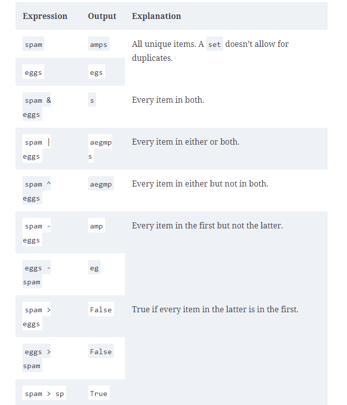
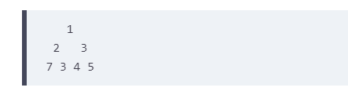

# Important python concepts
### resources
[python decorators] (https://www.youtube.com/watch?v=MjHpMCIvwsY)
[python design patterns] (https://refactoring.guru/design-patterns/python)
[google style guide] (https://google.github.io/styleguide/pyguide.html)
[slice notation] (https://stackoverflow.com/questions/509211/understanding-slice-notation)

### Why Python is slow compared to compiled languages?
http://jakevdp.github.io/blog/2014/05/09/why-python-is-slow/


### Coding standards
#### import module, not what is inside module. This enhances the readability
```python
import math # This is good
from math import sqrt # This is not
```
#### Guard your module from getting executed accidently
```python
if __name__ == '__main__':
    pass
    #call function in the module
```

#### don't make List and dict comprehension expression complicated

#### Don't use mutable python objects as default arguments
default arguments are evaluated once at module load times. They may cause issue in some cases.
dont don this:
```python
def default_arg_example(x=[]):
    x.append(1)
    print(x)
default_arg_example()
default_arg_example()
# this will print[1] and [1, 1]
```
instead do this:
```python
def default_arg_example(x=None):
    if not x:
        x = []
    x.append(1)
    print(x)
default_arg_example()
default_arg_example()

```

#### When you write getter and setter, use correct convention e.g. get_* and set_*

### Coding standards - ends

### python heap module
#### creating a min heap of custom objects:
```python
import heapq

class Person:
    def __init__(self, name):
        self.name = name
    def __repr__(self):
        return f'Person({self.name})'

    def __lt__(self, other):
        return len(self.name) < len(other.name)


if __name__ == '__main__':
    p1 = Person('Shashank')
    p2 = Person('Shreyansh')
    p3 = Person('Pooja')

    min_heap = []
    heapq.heappush(min_heap, p1)
    heapq.heappush(min_heap, p2)
    heapq.heappush(min_heap, p3)

    while min_heap:
        print(heapq.heappop(min_heap))

```
### python heap module -- ends

### What is raw string in python
backslash in python is used as a escape character. 
Sometimes, particularly when dealing with strings such as Windows filesystem paths 
or regular expression patterns which use backslashes extensively, 
the requirement to double-up on backslashes can be ugly and error prone. 
Python comes to the rescue with its raw strings. Raw strings don't support any escape sequences and are very much 
what-you-see-is-what-you-get. To create a raw string, precede the opening quote with a lower-case r:
```python
path = r'C:\Users\Merlin\Documents\Spells'
```

### string as collection of unicode points
A string is a sequence of Unicode code-points, and for the most part you can think of code-points 
as being like characters, although they aren't strictly equivalent. The sequence of code-points in a 
Python string is immutable, so once you've constructed a string, you can't modify its contents.
A code point is any one member of the set of of numerical values which make up the code space.
Each character is associated with a single code point, so GREEK CAPITAL LETTER SIGMA is assigned to U+03A3 and N-ARY 
SUMMATION is assigned to U+2211.  As we have done here, code points are often written in U+nnnn form where nnnn is a 
four, five or six digit hexadecimal number. Not all code points have yet been allocated to characters. 
For example, U+0378 is an unassigned code point, and there’s nothing to stop you including this code point in a Python
 str using the \u0378 escape sequence; hence, str really is a sequence of code points and not a sequence of characters

### Converting between bytes and str
To convert between bytes and str we must know the encoding of the byte sequence used to represent the string's 
Unicode code points as bytes. Python supports a wide-variety of so-called codecs such as UTF-8, UTF-16, ASCII, Latin-1,
 Windows-1251, and so on – consult the Python documentation for a current list of codecs

In Python we can encode a Unicode str into a bytes object, and going the other way we can decode a bytes object into
 a Unicode str. In either direction it's up to us to specify the encoding. Python won't — and generally speaking can't 
 do anything to prevent you erroneously decoding UTF-16 data stored in a bytes object using, say, a CP037 codec for 
 handling strings on legacy IBM mainframes.

If you're lucky the decoding will fail with a UnicodeError at runtime; if you're unlucky you'll wind up with a str 
full of garbage that will go undetected by your program.
```python
norsk = "Jeg begynte å fortære en sandwich mens jeg kjørte taxi på vei til quiz"
data = norsk.encode('utf-8')
print(data)
b'Jeg begynte \xc3\xa5 fort\xc3\xa6re en sandwich mens jeg kj\xc3\xb8rte taxi p\xc3\xa5 vei til quiz'
norwegian = data.decode('utf-8')
norwegian == norsk
True
```

### The __name__  type and executing modules from the command line
The Python runtime system defines some special variables and attributes, the names of which are delimited by double 
underscores. One such special variable is called __name__, and it gives us the means for our module to determine whether
 it has been run as a script or, instead, imported into another module or the REPL. To see how, add:
print(__name__)
```python
from urllib.request import urlopen


def fetch_words():
   with urlopen('http://sixty-north.com/c/t.txt') as story:
       story_words = []
       for line in story:
           line_words = line.decode('utf-8').split()
           for word in line_words:
               story_words.append(word)

       for word in story_words:
           print(word)

print(__name__)
```

now lets do import from console. you will notice it prints the name of the module.
```python
from text_encoding import words
text_encoding.words
```
next, run the module directly (in other words run the module as a script)
```shell script
$ python3 words.py
__main__
```
Therefore, we put following check in all the python modules which are supposed to be importable
and cann also run as script
```python
if __name__ == '__main__':
    pass
```
### enum. 
enum is used when you want to limit the value of a constant.

```python
class Condition(Enum):
    NEW = 0
    GOOD = 1
    OK = 2
```

### Functional Programming 
#### What is functional programming
In functional programming, computation is only performed using the function arguments as inputs and output of the function
is a new variable which is created without mutating any of the input variables.   
Following is a purely functional function:
```python
def a(items, v):
    return items + [v]
```
Following is an example of regular function
```python
def b(items, v):
    return items.append(v)
```
1. One major advantage of writing purely functional code is that it becomes trivially easy to run in parallel. Because there are no external variables needed and no external variables changed, you can easily parallelize the code to run on multiple processors or even on multiple machines. Assuming you can easily transfer the input variables and output results, of course.  

2. Because the functions are self-contained and don’t have any side effects, they mitigate several kinds of bugs. Mutating function arguments in-place, for example, is a great source of bugs. Additionally, a seemingly useless function call that modifies a variable in the parent scope couldn’t exist in a purely functional codebase.  

3. It makes testing much easier. If a function only has a given input and output and does not touch anything outside of those, you can test without having to set up an entire environment for that function. It also omits the need for sandboxing functions while testing them.

 
#### What are higher order functions
Functions which accept other functions in their parameter list


### Functional Programming  - ends

### runtime.txt and requirements.txt
runtime.txt specifies what version of python is used
requirements.txt specifies all the library dependencies
### Simple word count program
```python
from collections import Counter
from operator import itemgetter

def top_words_by_count(words, k=1):
    counter = Counter(words)
    word_count_list = []
    for key in counter:
        word_count_list.append((key, counter[key]))
    print(word_count_list)

    #sorted_wc_list = sorted(word_count_list, key= lambda word_count_tup : word_count_tup[1], reverse=True)
    sorted_wc_list = sorted(word_count_list, key= itemgetter(1), reverse=True)

    return sorted_wc_list[:k]
```

### return defualt value from dictionary
```python
_map = {'a': 'b'}
_map['c'] # this will throw error
_map.get('c', None) # this will return None

```

### dunder magic methods
1. functions, methods, modules that start with __ and end with __
2. meant to be called indirectly. e.g. n1.__add__(n2) gets called on n1 + n2
<br>
__str__ is mainly used to provide information to user of the class. __repr__ is used by developers to know how to create an object 

### self parameter
``` python
class Flight:

    def number(self):
        return "SN060"
f = Flight()
Flight.number(f)
```
### instance initializer
If provided, the initializer method is called as part of the process of creating a new object when we call the constructor. The initializer method must be called __init__() delimited by the double underscores used for Python runtime machinery. Like all other instance methods, the first argument to __init__() must be self.
<br>
If you're coming from a Java, C#, or C++ background it's tempting to think of __init__() as being the constructor. This isn't quite accurate; in Python the the purpose of __init__() is to configure an object that already exists by the time __init__() is called. The self argument is, however, analogous to this in Java, C#, or C++. In Python the actual constructor is provided by the Python runtime system and one of the things it does is check for the existence of an instance initializer and call it when present.

### Python classes
#### class methods
@classmathod decorator is used to mark a method in a class as a class method. 
This method will have access to all the class level variables. Generally, 
a classmethod is used to define an alternate constructor. Take a look at the below example:
```python
import time
class Date:
    # primary contructor
    def __init__(self, year, month, day):
        self.year = year
        self.month = month
        self.day = day
    @classmethod
    def today(cls):
        t = time.localtime()
        return cls(t.tm_year, t.tm_mon, t.tm_mday)
```
#### property access
```python
class Circle:
    def __init__(self, radius):
        self.radius = radius

    @property
    def radius(self):
        return self.diameter / 2.0
    
    @property.setter
    def radius(self, radius):
        self.diameter = 2 * radius

```
#### dataclasses
[dataclasses] (https://towardsdatascience.com/9-reasons-why-you-should-start-using-python-dataclasses-98271adadc66)
##### basic data classes
```python
from dataclasses import dataclass

@dataclass
class Position:
    name: str
    lon: float
    lat: float
```
##### immutable data classes
```python
from dataclasses import dataclass

@dataclass(frozen=True)
class Position:
    name: str
    lon: float = 0.0
    lat: float = 0.0
```

### decorators
lets understand decorators with a simple example. when you see below:
```python
@mydeco
def add(a, b):
    return a + b
```
you should imagine this:
```python
def add(a, b):
    return a + b

add = mydeco(add)
```
this is the definition of my deco
```python
def mydeco(func):
    def wrapper(*args, **kwargs):
        return func(*args, **kwargs)
    return wrapper
```

when you see below:
```python
import time
@once_per_n(4)
def slow_add(a, b):
    time.sleep(2)
    return a + b
```
you should imagine this
```python
import time
slow_add = once_per_n(4)(slow_add)

def once_per_n(n):
    def middle(func):
        last_invoked = 0

        def wrapper(*args, **kwargs):
            nonlocal last_invoked
            if time.time() - last_invoked < n:
                raise Exception('called too often')
            last_invoked = time.time()
            return func(*args, **kwargs)

        return wrapper
    return middle
```
#### maintain meta data of the decorated function.
Take below code and try to print __name__ and __doc__ meta data
```python
def a():
    """
    dummy fucntion
    """
    print('in a')
```
```shell script
a.__name__
'a'
a.__doc__
'\n    dummy fucntion\n    '
```
Now lets try to print __name__ and __doc__ of a decorated function
```python
def noop(f):
    def noop_wrapper():
        return f()
    #noop_wrapper.__name__ = f.__name__
    #noop_wrapper.__doc__ = f.__doc__
    return noop_wrapper

@noop
def hello():
    "Print a well-known message."
    print('hello world!')
```
they dont print any thing meaningful
```shell script
>>> hello.__name__
'noop_wrapper'
>>> hello.__doc__
>>>
```
This is where funtools.wraps comes in handy.
```python
import functools
def noop(f):
    @functools.wraps(f)
    def noop_wrapper():
        return f()

    return noop_wrapper
```
```shell script
>>> help(hello)
Help on function hello in module __main__:

hello()
    Print a well-known message.

>>> hello.__name__
'hello'
>>> hello.__doc__
'Print a well-known message.'
```

### decorators -ends

### Design patterns and pythonic code
#### checking for None
```python
# always use is operator with None
x = 1
if x is None:
    pass
```
#### chained comparison
```python
x = 5
if 0 < x < 5:
    print('x is in between 0 and 5')

if x > 0 and x < 5:
    print('x is in between 0 and 5')
```
#### conditional expression
```python
x = 15
def a():
    return 10 if x < 5 else 20
```

#### index and value of a collection
```python
ls = [True] * 5
for index, value in enumerate(ls):
    print(index, value)
```

### iterate collection in reverse
```python
names = ['John', 'Mark', 'Sandy']
for name in reversed(names):
    print(name)
```

### iterate multiple collection at the same time
```python
names = ['John', 'Mark', 'Sandy']
age = [11, 12 , 10]
for name, age in zip(names, age):
    print(','.join([name, age]))
```
### iterate collection in a sorted order
```python
colors = ['red', 'blue', 'green', 'yellow']
for color in sorted(colors):
    print(color)

for color in sorted(colors, reverse=True):
    print(color)

# Custom sorting
for color in sorted(colors, key=len):
    print(color)
```

### distinguishing multiple exist points in loop
else block only executes if for loop completes normally (without break)
```python
def find(seq, target):
    for i, value enumerate(seq):
        if value == target:
            break
    else:
        return -1
    return i

```

### looping over dictionary
```python
d = {'Mathew': 'blue', 'John': 'purple'}
# if you dont want to delete whole looping
for k in d:
    print(k)

# if you  want to delete whole looping
for k in d.keys():
    if k.startswith('M'):
        del d[k]

# loop over key and value at the same time

for k, v in d.items():
    print(k, v)

```

### create dictionary from two lists
```python
lst1 = ['a', 'b', 'c', 'd', 'b']
lst2 = [2, 3, 4, 5, 6]
new_dictionary = {}

for key, value in zip(lst1, lst2):
    if key in new_dictionary:
        new_dictionary[key] += value
    else:
        new_dictionary[key] = value

print(new_dictionary)
```

### iterate two iterables in parallel even if the length differs
```python
from itertools import zip_longest

print(list(zip_longest('abcdef', 'ghijklm'))) # (None, 'm')

```
### itreate a 2-D list column wise
```python
from itertools import zip_longest
a = [
    [1, 2],
    [3, 4],
    [5, 6]
]
# lets say, you want to iterate column wise
for tup in zip_longest(*a):
    print(tup)
```
### flattening a 2-D list
```python
a = [
    [1, 2],
    [3, 4],
    [5, 6]
]

x = [x for row in a for x in row]
```
### Counting with dictionary
```python
from collections import defaultdict
colors = ['red', 'blue', 'green', 'red', 'blue', 'green']
d = defaultdict(int)
for color in colors:
    d[color] +=1

```
### grouping example
```python
from collections import defaultdict


def group_by_count(ls_of_words):
    d = defaultdict(list)
    for word in ls_of_words:
        key = len(word)
        d[key].append(word)
    return d
if __name__ == '__main__':
    print(group_by_count(['a', 'b', 'cc', 'ddd']))
```
### use key arguments to improve readability

### unpacking sequences
```python
p = 'shashank', 35
name, age = p

```

### updating multiple state variable
```python
def fib(n):
    x, y = 0, 1
    for i in range(0, n):
        print(x)
        x, y = y, x + y


```

### updating sequences
always use dequeue if you need to modify the sequence. Dont use list

### how to open and close files
```python
with open('data.txt') as f:
    data = f.read()
```

### write docstrings
both module level docstrings and class level docstring

### use fsum to get accurate floating point sums
```python
from math import fsum
print(fsum([0.1]*10)) # this will print 1.0 
print(sum([0.1]*10)) # this will print 0.99999
```
### floating point divisions
```python
print(5/2) # 2.5
print(5 // 2) # 2
```

### Default dict skills
DefaultDict can be used to call a factor method in case a not exist.
set(), list(), dict() are examples of factory methods
```python
from collections import defaultdict
d = defaultdict(set)
d['k'].add('value') # d['k'] will retun and empty set and then we can add element in to it

# a real use case of defaultdict. Let us say you want to group names by their first letter
from pprint import pprint
names = ['tom', 'jerry', 'john', 'susan', 'tim']
d = defaultdict(list)
for name in names:
    feature = name[0]
    d[feature].append(name)

pprint(d)

```
### partially consuming an iterator
```python

```
### invert a dictionary
```python
e2s = {'one': 'uno', 'two': 'dos', 'three': 'tres'}
s2e = {v:k for k, v in e2s.items()}
print(e2s)
print(s2e)
```
### itertools and functools module
#### partial function
```python
from functools import partial
#partial freezes the first argument of the function
print(pow(2, 5))
twopow = partial(pow, 2)
print(twopow(5))

# one more example
def orderFunc(a,b,c,d):
      return a*4 + b*3 + c*2 + d

result = partial(orderFunc,a=5,b=6,c=7)
print(result(d=8))
```
#### reduce – Combining pairs into a single result
the reduce function implements a mathematical technique called folding. it applies a pair of previous result and next item in the list to a a function.  
Lets compute factorial 4:
```python
import functools
import operator
functools.reduce(operator.mul, range(1, 5))
```  
internally following is happening.  
```python
from operator import mul
mul(mul(mul(1, 2), 3), 4)

```
Lets try to implement reduce function ourselves:
```python
import operator

def reduce(f, iterable):
    result, *iterable = iterable
    for e in iterable:
        result = f(result, e)

    return result

print(reduce(operator.mul, list(range(1, 5))))
```
Using the form a, *b = c, we can split an iterable between the first item and the remaining ones. Which means that a, *b = [1, 2, 3] will result in a=1, b=[2, 3].

#### accumulate
it is similar to reduce but it also returns intermediate results.
```shell script
>>> import operator
>>> import itertools

# Sales per month
>>> months = [10, 8, 5, 7, 12, 10, 5, 8, 15, 3, 4, 2]
>>> list(itertools.accumulate(months, operator.add))
[10, 18, 23, 30, 42, 52, 57, 65, 80, 83, 87, 89]
```
#### Chain
The chain function is a simple but useful function that combines the results of multiple iterators. Very simple but also very useful if you have multiple lists, iterators, and so on—just combine them with a simple chain:  
```shell script
>>> import itertools

>>> a = range(3)
>>> b = range(5)
>>> list(itertools.chain(a, b))
[0, 1, 2, 0, 1, 2, 3, 4]
```

 if you have an iterable containing iterables, the easiest method is to use itertools.chain.from_iterable. The usage is as you would expect:  
 ```shell script
>>> import itertools

>>> iterables = [range(3), range(5)]
>>> list(itertools.chain.from_iterable(iterables))
[0, 1, 2, 0, 1, 2, 3, 4]
```

#### dropwhile/takewhile
The dropwhile function will drop all results until a given predicate evaluates to true. This can be useful if you are waiting for a device to finally return an expected result.  
That’s a bit difficult to demonstrate in a book, so we only have an example with the basic usage—waiting for a number greater than 3:  
```shell script
>>> import itertools

>>> list(itertools.dropwhile(lambda x: x <= 3, [1, 3, 5, 4, 2]))
[5, 4, 2]
```

#### count
The count function is quite similar to the range function, but there are two significant differences:  

The first is that this range is infinite, so don’t even try to do list(itertools.count()). You’ll definitely run out of memory immediately and it might even freeze your system.  
The second difference is that, unlike the range function, you can actually use floating-point numbers here, so there is no need for whole/integer numbers.  
```shell script
>>> import itertools

>>> list(itertools.islice(itertools.count(), 10))
[0, 1, 2, 3, 4, 5, 6, 7, 8, 9]

>>> list(itertools.islice(itertools.count(), 5, 10, 2))
[5, 7, 9]

>>> list(itertools.islice(itertools.count(10, 2.5), 5))
[10, 12.5, 15.0, 17.5, 20.0]
```


#### group by
lets group by list of words by the first character
```python
from collections import defaultdict

words = ['aa', 'ab', 'ba', 'bb', 'ca', 'cb', 'cc']
groups = defaultdict(list)

for word in words:
    groups[word[0]].append(word)

print(groups)
```

same thing can be achieved by group by function
```shell script
>>> import operator
>>> import itertools

>>> words = ['aa', 'ab', 'ba', 'bb', 'ca', 'cb', 'cc']

# Gets the first element from the iterable
>>> getter = operator.itemgetter(0)

>>> for group, items in itertools.groupby(words, key=getter):
...     print(f'group: {group}, items: {list(items)}')
group: a, items: ['aa', 'ab']
group: b, items: ['ba', 'bb']
group: c, items: ['ca', 'cb', 'cc']
```

#### High cohesion and low coupling
when a class's attributes and methods are closely related, it is said to have high cohesion. 
A class is cohesive if its contents make sense together as a whole. We want our classes to have high cohesion because 
if everything in a class is closely related, our concerns are likely to be well separated. A class with too many
 concerns has low cohesion because those concerns muddy the intent of the class. 
 Usually I end up creating a class only when this cohesion is already clear to me; some code already exhibits 
 relatedness through the data and behaviors it contains.

When a class depends on another class, those classes are said to be coupled.
If a class depends on many details of another class, such that changing one requires changing the other, 
those classes are tightly coupled. Tight coupling is expensive because it can lead to spending more time managing 
the ripple effects of a change. Loose coupling is the desired end state. You’ll learn more strategies for achieving 
loose coupling in chapter 10.

#### Encapsulation in python
Most often, encapsulation in Python is done with a class. In classes, functions become methods; methods are similar
to functions, but they are contained in a class and often receive an input that is either an instance of the class 
or the class itself.

In Python, modules are also a form of encapsulation. Modules are even higher-level than classes;
they group multiple related classes and functions together. For example, a module dealing with HTTP interactions 
could contain classes for requests and responses, as well as utility functions for parsing URLs. Most *.py files you 
encounter would be considered modules.

The largest encapsulation available in Python is a package. Packages encapsulate related modules into a directory 
structure. Packages are often distributed on the Python Package Index (PyPI) for others to install and reuse.

Abstraction and encapsulation work together by grouping related functionality together and hiding the parts of it that 
don’t matter to anyone else. This is sometimes called “information hiding,” and it allows the internals of a class 
(or system in general) to change rapidly without other code having to change at the same rate.

#### SOLID Principles
[design principles] (https://fi.ort.edu.uy/innovaportal/file/2032/1/design_principles.pdf)

##### DI
Dependency Inversion is the strategy of depending upon interfaces or abstract functions and classes, rather than upon concrete functions and classes.
Check the design_patterns/dependency_inversion in this repository.

### understanding type and meta class
#### type
1. Every thing in python is Object (functions, int, str etc)
2. When you create a class, it is also an Object of type 'type'
3. type following snippets
```python
class Test:
    pass

def func():
    pass
print(type(Test))
print(type(Test()))
print(type(func))
print(type(2))

```
Following is printed when you run the above code:
```shell script
<class 'type'>
<class '__main__.Test'>
<class 'function'>
<class 'int'>
```
What it shows is that even class is derived from and is an object of class 'type' 


### Generators
let's understand how generators are useful with a trivial example. If you run below code, it is most likely to crash due to memory issue:
```python
sq_nums = [i**2 for i in range(100000000)]
for sq_num in sq_nums:
    print(sq_num)
```
The suggested way to achieve the same thing is below:
```python
for num in range(100000000):
    print(num ** 2)
```
why above code succeeds? reason is, in the secon case range gives generattor which lazily emits one value at a time. Therefore
memory footprint is low in the second case.
<br>
Below is how you write a simple generator.
```python
def squared_number_gen(n):
    for i in range(n):
        yield i ** 2

gen = squared_number_gen(100)
for num in gen:
    print(num)
# generators are also iterators, so you could do following as well. In fact that is for loop does internally:
gen = squared_number_gen(2)
print(next(gen))
print(next(gen))
print(next(gen))
# Last print statement will throw StopIteration error since generator has reached the end.
``` 
In response to first iteration request (when next is called on the generator), it emits i **2 and then stops.
in response to next iteration request, it again moves to yield statement and emits i**2. When looping is over, the
generator function returns and StopIterator exception is thrown.
#### generator expressions
```python
numbers = [1, 2, 3, 4]
squares = (n ** 2 for n in numbers)
for n in squares:
    print(n)
```

### python name spaces
When you first open the Python interpreter, the built-in namespace is populated with all the stuff built into Python. 
This namespace contains built-in functions like print() and open(). These built-ins have no prefix, and
you don’t need to do anything special to use them. Python makes them available to you anywhere in your code.
That’s why the famously easy print('Hello world!') Just Works™ in Python.

Unlike in some languages, you won’t explicitly create namespaces in your Python code, 
but your code structure will affect what namespaces are created and how they interact.
As an example, creating a Python module automatically creates an additional namespace for that module. 
At its simplest, a Python module is a .py file that contains some code. A file named sales_tax.py, for example, 
is “the sales_tax module”:
```python
# sales_tax.py

def add_sales_tax(total, tax_rate):
    return total * tax_rate
```
Each module has a global namespace, which code in the module can access freely. 
Functions, classes, and variables that aren’t nested inside anything are in the module’s global namespace:
```python
# sales_tax.py

TAX_RATES_BY_STATE = {                        
    'MI': 1.06,
    # ...
}

def add_sales_tax(total, state):
    return total * TAX_RATES_BY_STATE[state]  
```
1.  TAX_RATES_BY_STATE is in the module’s global namespace.
2.  Code in the module can use TAX_RATES_BY_STATE without any fuss.

Functions and classes in a module also have a local namespace that only they can access:
```python
# sales_tax.py

TAX_RATES_BY_STATE = {
    'MI': 1.06,
    ###
}

def add_sales_tax(total, state):
    tax_rate = TAX_RATES_BY_STATE[state]  
    return total * tax_rate               
```
A module that wants to use a variable, function, or class from another module must import it into its global namespace. 
Importing is a way of pulling a name from somewhere else into the desired namespace.
```python
# receipt.py

from sales_tax import add_sales_tax                     


def print_receipt():
    total = ...
    state = ...
    print(f'TOTAL: {total}')
    print(f'AFTER TAX: {add_sales_tax(total, state)}')  
```
1 The add_sales_tax function is added to the receipt global namespace.
2 add_sales_tax still knows about TAX_RATES_BY_STATE and tax_rate from its own namespace.
So, to refer to a variable, function, or class in Python, one of the following must be true:

The name is in the Python built-in namespace.
The name is the current module’s global namespace.
The name is in the current line of code’s local namespace.
The precedence for conflicting names works in the opposite order: a local name will override a global name, 
which will override a built-in name. You can remember this because generally the definition most specific to the current code is the one that gets used

### refer a module's global name space variable in a function
```python
a = 1
def fn():
    global a
    a = 2

fn()
print(a) # this will print 2

```

### * operator in python
run the following code
```python
def toy1(x, y, z):
    print(x, y, z)
def toy2(*args):
    print(args)
    print(type(args))
a = [1, 2, 3]
print(a)
toy1(*a)
toy2(*a)
print('done')
```
it will print following:
<br>
[1, 2, 3]
<br>
1 2 3
<br>
(1, 2, 3)
<br>
<class 'tuple'>
<br>
done

### named tuple
This is how you create named tuples
```python
from collections import namedtuple
Task = namedtuple('Task', ['summary', 'owner', 'done', 'id'])
Task.__new__.__defaults__ = (None, None, False, None)
```

### Python env and dependency management
#### install a venv 
```shell script
pip install virtualenv
python -m venv modernpython
cd Scripts 
#on Windows
#activate
acvtivate

#deactivate
deactivate

# on mac/linux
source mypython/bin/activate
```

### statistics module in python
#### Random number generator
This is how you generate random number
```python
from random import random
from random import seed
print(random())
print(random())
# if you want reproducible result. set seed
seed(12345)
print(random())
print(random())
seed(12345)
print(random())
print(random())
```
#### choice, choices and sample
choice --> pick one
choices --> pick many with replacement
sample --> pick many with replacement
<br>
Let's say you have lottery numbers ranging from 1 to 60. You would like to choose 6 winner numbers 
```python
import random
sorted(random.sample(range(1, 57), k=6))
```
### statistics module in python - ends

### static code checking and type hints

#### this is how you provide types

```python
from typing import *
def a(x:int, y:int) -> int:
    return x + y

a(1, 2) # this will pass mypy static analysis check
a(1, 'Hello') # this will not pass mypy static analysis check
```
```shell script
python -m mypy <python file name>
```
```python
from typing import *

def x(x: int, y: Optional[int]=None) -> None:
    if y is None:
        y = 
```

### assert for checking values
```python
assert 5 == 3 + 2
assert 5 == 3 + 3
```

### how to read csv file
```python
import csv

with open('congress_votes_114-2016_s20.csv', encoding='utf-8') as f:
    reader = csv.reader(f)
    next(reader) # this is done to skip the first line (assuming first line is header)
    for row in reader:
        print(row)
```
### File related operations
#### glob module to read a directory with given regex
```python
from glob import glob
for filename in glob('congress_data/*.csv'):
    with open(filename, encoding='utf-8') as f:
        for line in f.readlines():
            print(line)
```

#### os.listdir and path module
```python
import os
# to list all the files in a directory. Please note, it only gives file names (not the full file path)
path = '/etc'
# to make full path, you should use path
for filename in os.listdir(path):
     full_filename = os.path.join(path, filename)  

```
### use bisect to search with in the range
```python
import bisect

cuts = [60, 70, 80, 90]
grades = 'FDCBA'
print(grades[bisect.bisect(cuts, 76)])
print(grades[bisect.bisect(cuts, 70)])
scores = [76, 90, 81, 45, 72]

grades_ = [grades[bisect.bisect(cuts, score)] for score in scores]
print(grades_)
```

### use heapq.merge to efficiently merge sorted arrays
```python
from heapq import merge

a = [5, 10, 15]
b = [1, 4, 12]
c = [3, 8, 16]
# this produces  generator which is also an iterator
it = merge(a, b, c)
print(next(it))
print(next(it))

```
### use itertools.slice to slice an iterator
```python
from itertools import islice

print(list(islice('abcdef', 2, 4)))
```

### interning to same space
```python
import sys
s = 'he'
t = 'llo'
u = 'hello'
v = s + t
print(u == v) ##True
print(u is v) # False
print(id(u), id(v)) # different ids

# when you use intern, python interpreter checks if there is already same string in the memory.
# in case there is a string, it does not create a new string.
# this is useful to reuse user names in the memory
u = sys.intern('hello')
v = sys.intern(s + t)
print(u == v) ##True
print(u is v) # True
print(id(u), id(v)) # same ids
```
### time module example
```python
import time
time.sleep(10)
time.time()
time.ctime()
```

### hashlib 

```python
import hashlib
b = 'a tale of two cities'.encode('utf-8')
b = hashlib.sha512(b)
b = hashlib.sha512(b)
b = hashlib.sha512(b)
b = hashlib.sha512(b)

# instead do this
p = 'a tale of two cities'.encode('utf-8')
h = hashlib.pbkdf2_hmac('sha256', p, 'some phrase'.encode('utf-8'), 10000)

```

### short circuit operation
```python
print('hello' and True)
print(True and 'hello')

```

### get size of any variable
```python
import sys
nums_squared_lc = [num**2 for num in range(5)] # this produces list
nums_squared_gc = (num**2 for num in range(5)) # this produces generator expression
sys.getsizeof(nums_squared_gc)
sys.getsizeof(nums_squared_lc)

```
### Iterators and Generators

#### How to implement iterator protocol
1. The __iter__ method, which returns an iterator
2. The __next__ method, which must be defined on the iterator
3. The StopIteration exception, which the iterator raises to signal the end of the iterations
<br>
The two terms iterable and iterator are very similar but have different meanings:
1. An iterable object can be put inside a for loop or list comprehension. For something to be iterable,
 it must implement the __iter__ method. That method should return an iterator.
<br>
2. An iterator is an object that implements the __next__ method.
<br>
3. An iterator is also an iterable. Which means you can pass an iterator to iter() and it will return itself:
<br>
[Trey Hunner on iterator] (https://treyhunner.com/2016/12/python-iterator-protocol-how-for-loops-work)


### generators
Introduced with PEP 255, generator functions are a special kind of function that return a lazy iterator. 
These are objects that you can loop over like a list. However, unlike lists, lazy iterators do not store their contents
in memory. 
When you call a generator function or use a generator expression, you return a special iterator called a generator. 
You can assign this generator to a variable in order to use it. When you call special methods on the generator, such
as next(), the code within the function is executed up to yield.
When the Python yield statement is hit, the program suspends function execution and returns the yielded value to the
caller. (In contrast, return stops function execution completely.) When a function is suspended, the state of that 
function is saved. This includes any variable bindings local to the generator, the instruction pointer, the internal 
stack, and any exception handling.
This allows you to resume function execution whenever you call one of the generator’s methods. In this way, all function evaluation picks back up right after yield
Let us say, you want to write a program to count lines  of a very large file. There are two ways to do it
```python
def csv_reader(file_name):
    file = open(file_name)
    result = file.read().split("\n")
    return result

csv_gen = csv_reader("some_csv.txt")
row_count = 0
for row in csv_gen:
    row_count += 1

print(f"Row count is {row_count}")
```
Above code will throw out of memory error if file size is very large. The reaon is: file.read().split("\n") puts the lines
in a list.
Below is a better option
```python
def csv_reader(file_name):
    for row in open(file_name, "r"):
        yield row

csv_gen = csv_reader("some_csv.txt")
row_count = 0
for row in csv_gen:
    row_count += 1

print(f"Row count is {row_count}")
```

#### generate infinite sequence using generators
```python
import time
def infinite_sequence(start_counter = 1):
    while True:
        yield start_counter
        start_counter += 1

for i in infinite_sequence():
    print(i)
    time.sleep(1)
```

#### generator expression
```python
nums_squared_lc = [num**2 for num in range(5)] # this produces list
nums_squared_gc = (num**2 for num in range(5)) # this produces generator expression
```

#### getattr in python
It allows you to dynamically connect with objects based on your input. it is useful when dealing with custom obejcts and modules
```python
class A:
    def foo(self):
        print('in foo')
    def bar(self):
        print('in bar')
obj = A()
# you can not do this
for x in ['foo', 'bar']:
    obj.x()

# But you can do this
for x in ['foo', 'bar']:
    getattr(obj, x)()


```

#### callable instances.
```python
import socket


class Resolver:

    def __init__(self):
        self._cache = {}

    def __call__(self, host):
        if host not in self._cache:
            self._cache[host] = socket.gethostbyname(host)
        return self._cache[host]
resolve = Resolver()
resolve('sixty-north.com') ## syntactic sugar for resolve.__call__('sixty-north.com')
```
#### check for callable
To determine whether an object (including functions) is a callable or not:
```python
def is_even(x):
     return x % 2 == 0
callable(is_even)
```

#### *args and **kwargs
One of the most common uses of *args and **kwargs is to use them in combination to forward all arguments of one function to another.
For example, suppose we define a function for tracing the arguments and return values of other functions. 
We pass the function whose execution is to be traced as one argument, but that function could itself take any arguments whatsoever. 
We can use extended parameter syntax to accept any arguments to our tracing function and extended call syntax to pass those arguments to the traced function:
```python
def trace(f, *args, **kwargs):
    print("args =", args)
    print("kwargs =", kwargs)
    result = f(*args, **kwargs)
    print("result =", result)
    return result

trace(int, "ff", base=16)

```

#### python scoping rules
L  
E  
G  
B  
first the Local scope is checked, then any Enclosing scope, next the Global scope, and finally the Builtin scope.


### First order function
First order functions are those functions which can return functions.
In following example, enclosing is a first order function.
```python
def enclosing():
    def local_func():
        print('local func')
        return local_func

lf = enclosing()
lf()
```
### closures
#### local function
when you define a function inside a function, it is called local funciton.
```python
def enclosing():
    def local_fn():
        print('local fn')
    return local_fn
``` 
local functions are defined on each call of the enclosing function. just like module level functions, definitions of local  
functions happen at the run time. Also, each time enclosing function is called, a new local function definition is bound.  
it is akin to creating a local variable in the enclosing function.
```shell script
>>> lf1 = enclosing()
>>> lf2 = enclosing()
>>> lf3 = enclosing()
>>> lf1
<function enclosing.<locals>.local_func at 0x10a38ec10>
>>> lf2
<function enclosing.<locals>.local_func at 0x10a38ed30>
>>> lf3
<function enclosing.<locals>.local_func at 0x10a38ef70>
```
As you can see that local function can be returned from their defining scope (in above case enclosing() is the defining scope) and used (invoked ) in another scope.  
This raises an important question, how does a local function use bindings to objects defined in a scope which no longer exist? That is once a local function is returned from its    
enclosing scope, that enclosing scope is gone, along with any local object it defined. How can the local function operate with out that enclosing scope?  
The answer is: local function along with the object defined in the enclosing function, forms a closure.
Closure essentially remembers the local objects from the enclosing scope that local function needs. 

#### closure
When a local function uses any variable from the enclosing function, it turns in to a closure.
```python
def enclosing():
    x = 'closed over'
    def local_fn():
        print(x)
    return local_fn
``` 
```shell script
>>> lf = enclosing()
>>> lf()
closed over
>>> lf.__closure__
(<cell at 0x10220f2f0: str object at 0x1021f8bb0>,)
```
A very common use for closures is in function factories. These factories are functions that return other functions,    
where the returned functions are specialized in some way based on arguments to the factory. In other words, the factory  
function takes some arguments. It then creates a local function which takes its own arguments but also uses the arguments  
passed to the factory. The combination of runtime function definition and closures makes this possible.  
```python
import math

def raise_to(exp):
    def raise_to_exp(x):
        return math.pow(x, exp)
    return raise_to_exp

square = raise_to(2)
cube = raise_to(3)

print(square(5))
print(cube(5))
```


#### nonlocal keyword
When you make a name binding (e.g. x = 8) in a function (assuming x already exists as at global level or module level)  
you are actually creating a new name binding.
```python
message = 'global'

def enclosing():
    message = 'enclosing'

    def local():
        message = 'local'
```
lets say you want to refer to the global x,  then you will redefine x as global x.  
But, lets say if you want to refer to enclosing varibale in the local function (local() in this case)  
you have to redefine x as nonlocal x
 ```python
message = 'global'

def enclosing():
    message = 'enclosing'

    def local():
        nonlocal message
        message = 'local'

    print('enclosing message:', message)
    local()
    print('enclosing message:', message)

print('global message:', message)
enclosing()
print('global message:', message)
```
```shell script
global message: global
enclosing message: enclosing
enclosing message: local
global message: global
```
### closures - ends

### colections protocols
1. The container protocol, which allows us to test for item membership in a collection.
2. The sized protocol, which allows us to determine the number of items in a collection.
3. The iterable protocol which yield the items in the collection one by one. We encountered the iterable protocol previously in chapter 7. Here we’ll utilise that knowledge directly.
4. The sequence protocol which supports random read access to collections.
5. The set protocol which support various set operations such as set-intersection.


### inf in python
```python
import math
a = math.inf
b = -math.inf

```

### Object Oriented programming
#### Make an abstract class
```python
from abc import ABC, abstractmethod
class Employee(ABC):
    name: str
    id: str
    
    @abstractmethod
    def compute_pay(self) -> float:
        

class HourlyEmployee(Employee):
    pass
```

### Python design patters
#### set operations
Following examples are from mastering python book by Rick Van.  
Some sample set examples:

Lets understand few operations with code examples:
```python
current_users = set(('a', 'b', 'd'))
new_users = set(('b', 'c', 'd', 'c'))
to_insert = new_users - current_users
to_delete = current_users - new_users
unchanged = new_users & current_users

```
```shell script
>>>to_insert
{'c'}
>>>to_delete
{'a'}
>>>unchanged
{'d', 'b'}
```

#### Chainmap
Combining multiple scopes with ChainMap
Introduced in Python 3.3, ChainMap allows you to combine multiple mappings (dictionaries, for example) into one. 
This is especially useful when combining multiple contexts. For example, when looking for a variable in your current scope,  
by default, Python will search in locals(), globals(), and, lastly, builtins.  
 

```python
import builtins
import collections

key = 'something to search for'

mappings = collections.ChainMap(locals(), globals(), builtins)

print(mappings[key])
```
#### Sorting collections using heapq
The heapq module is a great little module that makes it very easy to create a priority queue in Python.  
It is a data structure that will always make the smallest (or largest, depending on the implementation) item available with minimum effort.  
The API is quite simple, and one of the best examples of its usage can be seen in the OrderedDict object. While you might not need it often,  
it is a very useful structure if you need it. And understanding the inner workings is important if you wish to understand the workings of classes such as OrderedDict.  

```python
import heapq
heap = [1, 3, 5, 7, 2, 4, 3]
heapq.heapify(heap)
```
```shell script
>>>heap
[1, 2, 3, 7, 3, 4, 5]
>>> while heap:
...     heapq.heappop(heap), heap
(1, [2, 3, 3, 7, 5, 4])
(2, [3, 3, 4, 7, 5])
(3, [3, 5, 4, 7])
(3, [4, 5, 7])
(4, [5, 7])
(5, [7])
(7, [])
```
heapq does not create any special object. it consists of few useful methods which is used to treat regular list as heap.  
The really confusing part, at first glance, is the sort order. The array is actually sorted but not as a list; it is sorted as a tree.  
To illustrate this, take a look at the following tree, which shows how the tree is supposed to be read:  


#### Searching through sorted collections using bisect
The bisect module inserts items in an object in such a way that they stay sorted and are easily searchable. If your primary purpose is searching, then bisect should be your choice. If you’re modifying your collection a lot, heapq might be better for you.

As is the case with heapq, bisect does not really create a special data structure. The bisect module expects a list and expects that list to always be sorted. It is important to understand the performance implications of this. While appending items to a list has O(1) time complexity, inserting has O(n) time complexity, making it a very heavy operation. Effectively, creating a sorted list using bisect takes O(n*n), which is quite slow, especially because creating the same sorted list using heapq or sorted() takes O(n*log(n)) instead.

If you have a sorted structure and you only need to add a single item, then the bisect algorithm can be used for insertion. Otherwise, it’s generally faster to simply append the items and call list.sort() or sorted() afterward.

To illustrate, we have these lines:
```shell script
>>> import bisect

# Using the regular sort:
>>> sorted_list = []
>>> sorted_list.append(5)  # O(1)
>>> sorted_list.append(3)  # O(1)
>>> sorted_list.append(1)  # O(1)
>>> sorted_list.append(2)  # O(1)
>>> sorted_list.sort()  # O(n * log(n)) = 4 * log(4) = 8
>>> sorted_list
[1, 2, 3, 5]

# Using bisect:
>>> sorted_list = []
>>> bisect.insort(sorted_list, 5)  # O(n) = 1
>>> bisect.insort(sorted_list, 3)  # O(n) = 2
>>> bisect.insort(sorted_list, 1)  # O(n) = 3
>>> bisect.insort(sorted_list, 2)  # O(n) = 4
>>> sorted_list
[1, 2, 3, 5]
```

For a small number of items, the difference is negligible, but the number of operations needed to sort using bisect quickly grows to a point where the difference will be large.  
For n=4, the difference is just between 4 * 1 + 8 = 12 and 1 + 2 + 3 + 4 = 10, making the bisect solution faster. But if we were to insert 1,000 items, it would be 1000 + 1000 * log(1000) = 10966  
versus 1 + 2 + … 1000 = 1000 * (1000 + 1) / 2 = 500500. So, be very careful while inserting many items.  

#### dict union operator
This is not actually a separate advanced collection, but it is advanced usage of the dict collection. Since Python 3.9,  
we have a few easy options for combining multiple dict instances. The “old” solution was to use dict.update(), possibly combined with dict.copy()  
to create a new instance. While that works fine, it is rather verbose and a tad clunky.

Since this is a case where a few examples are much more useful than just explanation, let’s see how the old solution works:  
```shell script
>>> a = dict(x=1, y=2)
>>> b = dict(y=1, z=2)

>>> a | b
{'x': 1, 'y': 1, 'z': 2}
```


